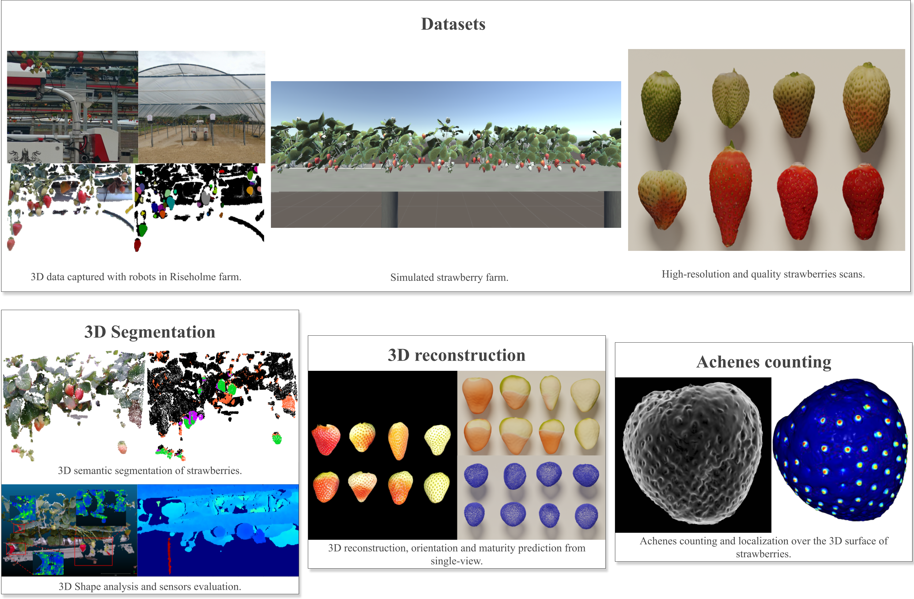

# Automated 3D traits measurement for strawberries



Repository aimed at compiling code, papers, demos etc.. related to my PhD on 3D vision and machine learning for fruit detection and shape estimation at the university of Lincoln


## Datasets

### Riseholme Farm pointclouds + simulation


### 3D strawberries photogrammetry high-resolution models 


### Achene annotations

The achenes annotation for the data used in the achene counting paper can be found in this [file](https://drive.google.com/file/d/1rwVTc7_EE39_1Jx-FAq-b4V3N4XdU-fh/view?usp=sharing). For each point there is the file name (identical to mesh name), number of achenes and location. Original 3D dataset can be downloaded from [here](https://datadryad.org/stash/dataset/doi:10.25338/B8V308), and processed using the code in Achenes folder.


## 3D Segmentation

### Computers and electronics in agriculture : 3D shape sensing and deep learning-based segmentation ofstrawberries

Code for the submission to Computers and electronics in agriculture. You will find CNN3D model, and the training + testing files and an example of dataset loading class for the simulated data. 
You can find the code for PointNet on my other repository : https://github.com/lelouedec/3DNetworksPytorch
For SegNet you can find a pytorch model here : https://github.com/trypag/pytorch-unet-segnet

If you are interested by this work please contact me by email (see profile) for any collaboration, and if the paper inspires you please cite it:
```bib
@article{le20213d,
  title={3D shape sensing and deep learning-based segmentation of strawberries},
  author={Le Louëdec, Justin and Cielniak, Grzegorz},
  journal={Computers and Electronics in Agriculture},
  volume={190},
  pages={106374},
  year={2021},
  publisher={Elsevier}
}
```
## 3D reconstruction and orientation prediction

### UKRAS : Determining shape of strawberry crops with spherical harmonics

We present our UKRAS 2020 paper in the folder called UKRAS. You can find there the PDF for the paper and some code presented as a jupyter notebook, to try and reproduce the paper. Following the jupyter notebok let you learn about how to open and process the point cloud, compute forward spherical harmonics transform, reconstruct and plot the obtained coefficients.

If you are interested by this work please contact me by email (see profile) for any collaboration, and if the paper inspires you please cite it:
```bib
@article{louedec_cielniak_2020, 
title={Determining shape of strawberry crops with spherical harmonics}, 
DOI={10.31256/mc8hl1a}, 
journal={UKRAS20 Conference: “Robots into the real world” Proceedings}, 
author={Le Louëdec, Justin and Cielniak, Grzegorz}, 
year={2020}}
```

### Single image orientation prediction

Coming soon....

### Single image 3D reconstruction

Coming soon....


## Achene counting

### BMVC 2021 : Gaussian map predictions for 3D surface feature localisation and counting

In the Achenes folder, you will in due time the code for the main parts of the paper published and presented this year at BMVC 2021.

If you are interested by this work please contact me by email (see profile) for any collaboration, and if the paper inspires you please cite it:
```bib
@inproceedings{DBLP:conf/bmvc/LouedecC21,
  author    = {Justin Le Louëdec and
               Grzegorz Cielniak},
  title     = {Gaussian map predictions for 3D surface feature localisation and counting},
  booktitle = {32nd British Machine Vision Conference 2021, {BMVC} 2021, Online,
               November 22-25, 2021},
  pages     = {423},
  publisher = {{BMVA} Press},
  year      = {2021},
  url       = {https://www.bmvc2021-virtualconference.com/assets/papers/1417.pdf},
  timestamp = {Wed, 22 Jun 2022 16:52:45 +0200},
  biburl    = {https://dblp.org/rec/conf/bmvc/LouedecC21.bib},
  bibsource = {dblp computer science bibliography, https://dblp.org}
}
```

